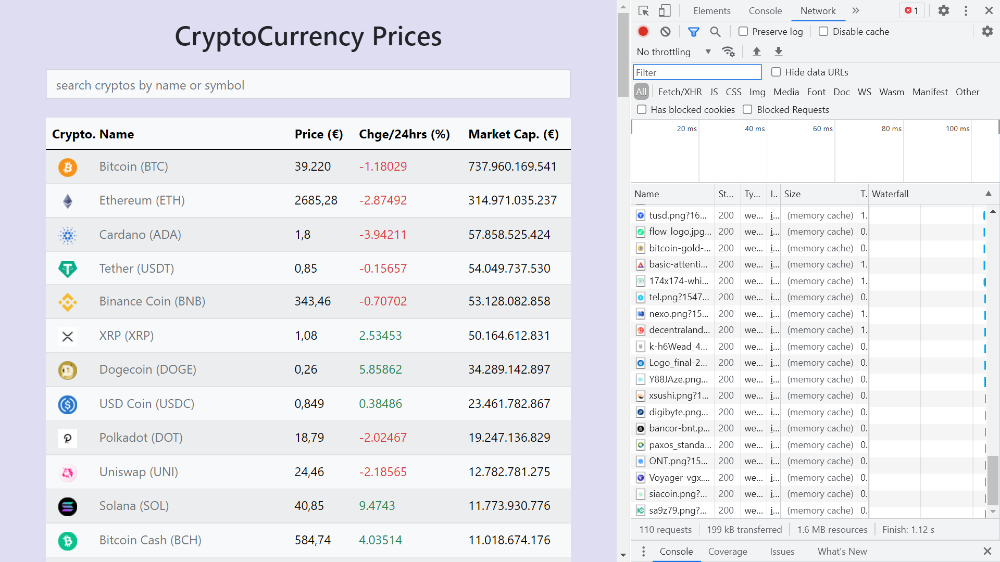

# :zap: Svelte Rollup Crypto

* Svelte library used with Bootstrap & Rollup module bundler to display data from the [CoinGecko Cryptocurrency API](https://www.coingecko.com/en/api)
* Code from [Fazt Code](https://www.youtube.com/channel/UCMn28O1sQGochG94HdlthbA) with modificationa - see [:clap: Inspiration](#clap-inspiration) below.
* **Note:** to open web links in a new window use: _ctrl+click on link_


## :page_facing_up: Table of contents

* [:zap: Svelte Rollup Crypto](#zap-svelte-rollup-crypto)
  * [:page_facing_up: Table of contents](#page_facing_up-table-of-contents)
  * [:books: General Info](#books-general-info)
  * [:camera: Screenshots](#camera-screenshots)
  * [:signal_strength: Technologies](#signal_strength-technologies)
  * [:floppy_disk: Setup](#floppy_disk-setup)
  * [:computer: Code Examples](#computer-code-examples)
  * [:clipboard: Status & To-Do List](#clipboard-status--to-do-list)
  * [:clap: Inspiration](#clap-inspiration)
  * [:file_folder: License](#file_folder-license)
  * [:envelope: Contact](#envelope-contact)

## :books: General info

* [Svelte onMount function](https://svelte.dev/docs#onMount) used during initialisation, schedules a callback to run after component mounted to DOM
* Nearly all code is in `App.svelte` file. Minified Bootstrap added in `index.html` header
* Table is partially responsive

## :camera: Screenshots



## :signal_strength: Technologies

* [Svelte v3](https://svelte.dev/) fast front-end UI library with small bundles of highly-optimized vanilla JavaScript & declarative transitions that does not use a virtual DOM
* [Bootstrap v5](https://getbootstrap.com/docs/5.0/getting-started/introduction/) framework for styling and components
* [Rollup v7](https://www.npmjs.com/package/rollup) JS module bundler
* [Sirv v1](https://github.com/lukeed/sirv) optimized middleware & CLI application for serving static files
* [CoinGecko Cryptocurrency API](https://www.coingecko.com/en/api) - see `example-coin.json for API response format`

## :floppy_disk: Setup

* `npm i` to install dependencies
* `npm run dev` to run dev server
* `npm run build` to build optimised version
* `npm run start` to run the newly built app

## :wrench: Testing

* N/A

## :computer: Code Examples

* `App.svelte` table to display results from crypto API fetch

```svelte
<table class="table table-light table-hover my-4">
    <thead>
      <tr>
        {#each headings as heading}
          <th class={heading == "Coin" ? "px-3" : ""}>{heading}</th>
        {/each}
      </tr>
    </thead>
    <tbody>
      {#each filteredCoins as coin, i}
        <tr>
          <td>
            

            <span class="ms-3 text-muted">
              {coin.name}
            </span>
          </td>
          <td>
            {coin.current_price.toLocaleString()}
          </td>
          <td
            class={coin.price_change_24h > 0
              ? "text-success"
              : "text-danger"}
          >
            {coin.price_change_percentage_24h}
          </td>
          <td>
            {coin.market_cap.toLocaleString()}
          </td>
        </tr>
      {/each}
    </tbody>
  </table>
```

## :cool: Features

* compact build folder - weighs 88KB

## :clipboard: Status & To-Do List

* Status: Working
* To-Do: Nothing

## :clap: Inspiration

* [Fazt Code: Svelte Precios Crypto | Svelte & CoinGecko API](https://www.youtube.com/watch?v=uGhiM19d950&t=19s) in Spanish
* [MDN Web Docs: Getting started with Svelte](https://developer.mozilla.org/en-US/docs/Learn/Tools_and_testing/Client-side_JavaScript_frameworks/Svelte_getting_started)

## :file_folder: License

* N/A

## :envelope: Contact

* Repo created by [ABateman](https://github.com/AndrewJBateman), email: gomezbateman@yahoo.com
